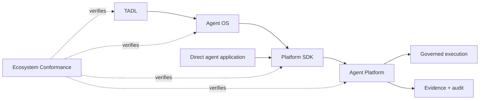

# Tinlance Agent Ecosystem Conformance

The Platform SDK is one of the two primary consumers exercised by the cross-repository conformance gate; the Platform remains authoritative.

## SDK obligations

The conformance gate verifies that the SDK:

- speaks the versioned Platform API 1.1 contract;
- preserves tenant/subject assertions for Platform verification;
- sends idempotency metadata for consequential operations;
- propagates W3C trace context without treating it as authority;
- rejects unsafe production transport configuration; and
- remains authority-free and does not implement authorization, approvals, secrets, sandboxing, or authoritative evidence.

The TADL repository pins reviewed Platform, SDK, and OS revisions and exercises the SDK and OS adapter against the same Platform reference boundary.

## Production boundary

Passing conformance proves client/wire compatibility and selected security invariants. It does not certify a production Platform deployment or external infrastructure.