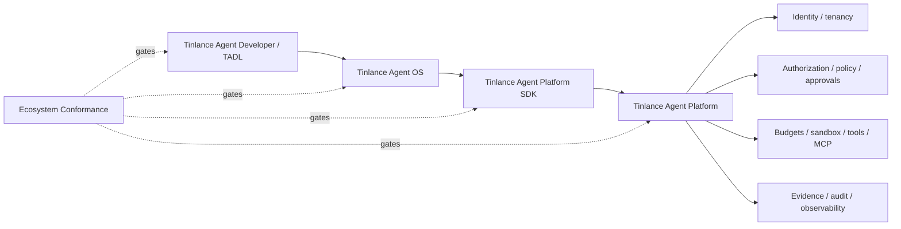

# Tinlance Agent Ecosystem Integration

The Platform SDK is the typed client boundary between Agent OS/application code and the authoritative Platform.

TADL owns developer artifacts; Agent OS owns lifecycle and composition; the SDK owns client-side contract ergonomics; Agent Platform owns all consequential authority.

**Canonical wire contract:** API version 1.1, `POST /v1/agent-platform`. Consequential calls use stable idempotency keys. Optional W3C `traceparent` is propagated without making trace context an authority signal.

The SDK must remain authority-free. It must not decide authorization, mint capabilities, validate approval sufficiency, expose secrets as ordinary model context, execute tools outside Platform governance, or create authoritative evidence.

Compatibility is proven by the cross-repository integration gate maintained in TADL. That gate installs the reviewed Platform and SDK revisions, starts the Platform reference HTTP boundary, and exercises both the official SDK and Agent OS adapter against the same contract.

## Conformance

The Agent Developer-hosted conformance suite remains the developer-system compatibility gate, while TSIC is the canonical ecosystem integration and certification authority. This repository consumes the pinned TSIC contract directly and verifies API 1.1 interoperability, identity binding, idempotency, trace propagation, transport security, and authority-free SDK dependency direction against reviewed revisions.

## Milestone vocabulary

M0–M14 remain the canonical Agent Platform roadmap. The supplemental M13.1–M13.3 production-runtime hardening labels are implementation traceability only; they do not redefine canonical milestone meaning. Post-M14 production maturity is governed by M15–M29.

## Budget governance boundary

Consequential execution budget is Platform authority. Requests may carry declared execution limits, but only the Platform execution boundary can reserve, consume or release budget. Reservations are bound to tenant, agent, run, action and resource; quota exhaustion and scope/replay conflicts fail closed. SDK/OS/TADL layers must not implement local budget authority or treat client-side estimates as authorization.

## M13.5 tool authority reconciliation

The SDK may model tool invocation metadata and permits, but it never creates or validates execution authority. Consequential tool execution is authorized by Platform-issued permits after Platform policy evaluation; local SDK metadata is not authority.

## M13.6–M13.8 production-runtime reconciliation

M13.6–M13.8 reconciliation: the SDK exposes consumer metadata/contracts only. Secret handles, evidence/audit attestations and observability identifiers do not confer authority. Platform remains the sole authority plane; external secret/KMS/telemetry providers remain deployment adapters.

## M13.5 tool authority reconciliation

The SDK may model tool invocation metadata and permits, but it never creates or validates execution authority. Consequential tool execution is authorized by Platform-issued permits after Platform policy evaluation; local SDK metadata is not authority.

## M13.6 — Secrets and credential governance

M13.6 secret governance: only execution-scoped secret handles are valid; tenant, principal, agent, execution, capability, purpose, audience and time are enforced by Platform. The legacy unscoped broker fails closed.

## M13.7 — Evidence, audit and non-repudiation

M13.7 evidence/audit boundary: SDK provenance metadata is non-authoritative. Platform evidence and audit records are tenant/run scoped, integrity-protected, and optionally attested; SDK cannot mint or validate authority from telemetry or evidence.

## M13.8 — Observability and incident correlation

M13.8 observability boundary: SDK trace and telemetry identifiers are correlation metadata only. Platform owns security-event correlation and incident context; telemetry never grants authority or bypasses policy.

## Final M13.4-M13.8 authority reconciliation

The SDK is a declaration/client surface only. It never mints, validates, consumes, or substitutes for Platform execution authority.

- Budget declarations are advisory inputs; Platform owns reservation/admission/settlement.
- Tool/MCP execution requires a Platform-issued single-use permit.
- Sandbox roots and resource ceilings are Platform-governed controls.
- Secret references are metadata; scoped secret resolution occurs only under Platform execution scope.
- Evidence/audit integrity and attestation are Platform evidence contracts.
- Telemetry identifiers are correlation metadata and never authorize execution.

The Platform currently hardens MCP calls with sealed permits, exact intent binding, fail-closed authorization, and single-use replay protection. The SDK must remain compatible with these boundaries without duplicating them.
