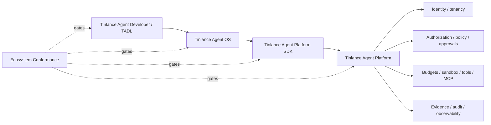

# Tinlance Agent Ecosystem Integration

The Platform SDK is the typed client boundary between Agent OS/application code and the authoritative Platform.

TADL owns developer artifacts; Agent OS owns lifecycle and composition; the SDK owns client-side contract ergonomics; Agent Platform owns all consequential authority.

**Canonical wire contract:** API version 1.1, `POST /v1/agent-platform`. Consequential calls use stable idempotency keys. Optional W3C `traceparent` is propagated without making trace context an authority signal.

The SDK must remain authority-free. It must not decide authorization, mint capabilities, validate approval sufficiency, expose secrets as ordinary model context, execute tools outside Platform governance, or create authoritative evidence.

Compatibility is proven by the cross-repository integration gate maintained in TADL. That gate installs the reviewed Platform and SDK revisions, starts the Platform reference HTTP boundary, and exercises both the official SDK and Agent OS adapter against the same contract.

## Conformance

The Agent Developer-hosted conformance suite is the executable compatibility gate for the four repositories. It verifies API 1.1 interoperability, identity binding, idempotency, trace propagation, transport security, and authority-free SDK dependency direction against pinned revisions.

## Milestone vocabulary

M0–M14 remain the canonical Agent Platform roadmap. The supplemental M13.1–M13.3 production-runtime hardening labels are implementation traceability only; they do not redefine canonical milestone meaning. Post-M14 production maturity is governed by M15–M29.

## Budget governance boundary

Consequential execution budget is Platform authority. Requests may carry declared execution limits, but only the Platform execution boundary can reserve, consume or release budget. Reservations are bound to tenant, agent, run, action and resource; quota exhaustion and scope/replay conflicts fail closed. SDK/OS/TADL layers must not implement local budget authority or treat client-side estimates as authorization.

## M13.5 tool authority reconciliation

The SDK may model tool invocation metadata and permits, but it never creates or validates execution authority. Consequential tool execution is authorized by Platform-issued permits after Platform policy evaluation; local SDK metadata is not authority.

## M13.6–M13.8 production-runtime reconciliation

M13.6–M13.8 reconciliation: the SDK exposes consumer metadata/contracts only. Secret handles, evidence/audit attestations and observability identifiers do not confer authority. Platform remains the sole authority plane; external secret/KMS/telemetry providers remain deployment adapters.
