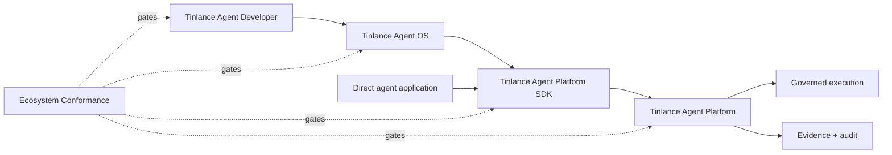

# Tinlance Agent Ecosystem Integration

The Platform SDK is the typed client boundary between Agent OS/application code and the authoritative Platform.

TADL owns developer artifacts; Agent OS owns lifecycle and composition; the SDK owns client-side contract ergonomics; Agent Platform owns all consequential authority.

**Canonical wire contract:** API version 1.1, `POST /v1/agent-platform`. Consequential calls use stable idempotency keys. Optional W3C `traceparent` is propagated without making trace context an authority signal.

The SDK must remain authority-free. It must not decide authorization, mint capabilities, validate approval sufficiency, expose secrets as ordinary model context, execute tools outside Platform governance, or create authoritative evidence.

Compatibility is proven by the cross-repository integration gate maintained in TADL. That gate installs the reviewed Platform and SDK revisions, starts the Platform reference HTTP boundary, and exercises both the official SDK and Agent OS adapter against the same contract.

## Conformance

The TADL-hosted conformance suite is the executable compatibility gate for the four repositories. It verifies API 1.1 interoperability, identity binding, idempotency, trace propagation, transport security, and authority-free SDK dependency direction against pinned revisions.
